class: inverse

<div class="my-footer"><span>@chendaniely
&emsp;&emsp;&emsp;&emsp;&emsp;&emsp;NYR Conference 2020
&emsp;&emsp;&emsp;&emsp;&emsp;&emsp;&emsp;&emsp;&emsp;&emsp;&emsp;&emsp;&emsp;
&emsp;&emsp;&emsp;&emsp;&emsp;&emsp;&emsp;&emsp;&emsp;&emsp;&emsp;&emsp;&emsp;
https://github.com/chendaniely/rstatsnyc_2020-learnr_gradethis</span></div>

<center>
<div class="hello">hi!</div>
</center>

---

class: inverse

# I'm Daniel
.pull-left[
</img>
]

.pull-right[
- PhD Student: Virginia Tech
  - Data Science education & pedagogy
  - Medical, Biomedical, Health Sciences
    - https://github.com/chendaniely/dissertation
  - Advisor: Anne Brown, PhD
      - https://www.databridge.dev/
      - https://bevanbrownlab.com/
-  2019 Inten at RStudio
  - [`gradethis`](https://github.com/rstudio-education/gradethis)
  - Code grader for [`learnr`](https://github.com/rstudio/learnr) documents
- Author:
<center>
</img>
</center>
]

---

class: center

# How's Quarantine?

.pull-left[
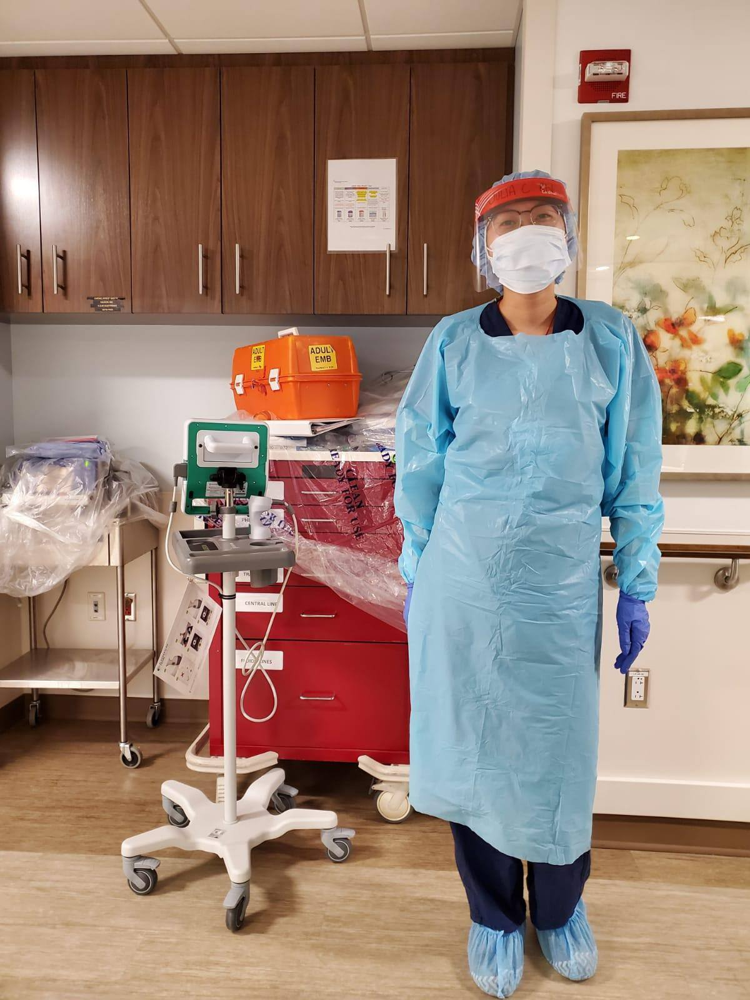</img>
]
.pull-right[
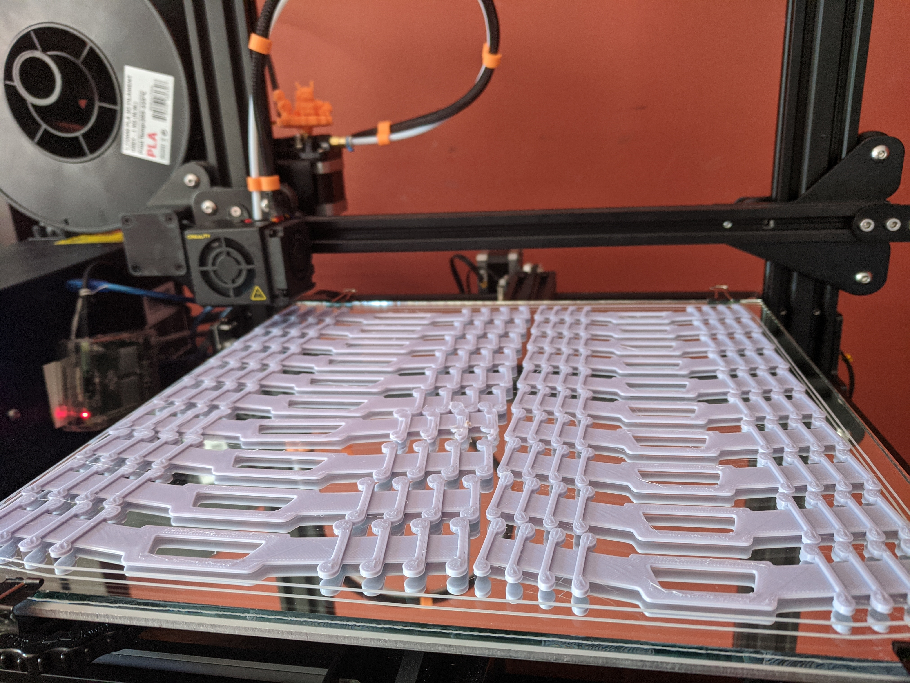</img>
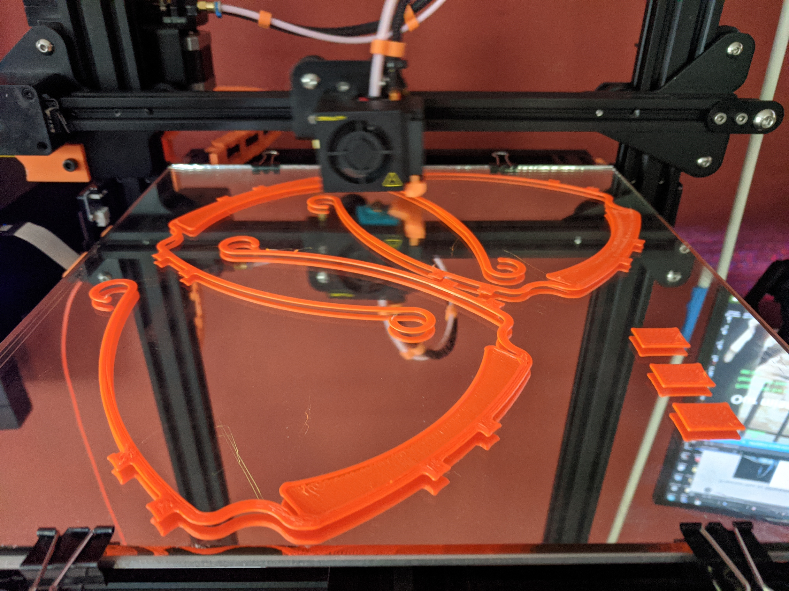</img>
]


---

# How's Quarantine?

<div class="row" id="fill">
  <div class="column">
    </img>
  </div>
  <div class="column">
    </img>
  </div>
  <div class="column">
    </img>
  </div>
  <div class="column">
    </img>
  </div>
</div>

.pull-left[
https://github.com/chendaniely/animal_crossing

https://github.com/chendaniely/animalcrossing
]
.pull-right[
https://www.twitch.tv/chendaniely
]

---

# Hobbes -- Blue Heeler

.pull-left[
</img>
]
.pull-right[
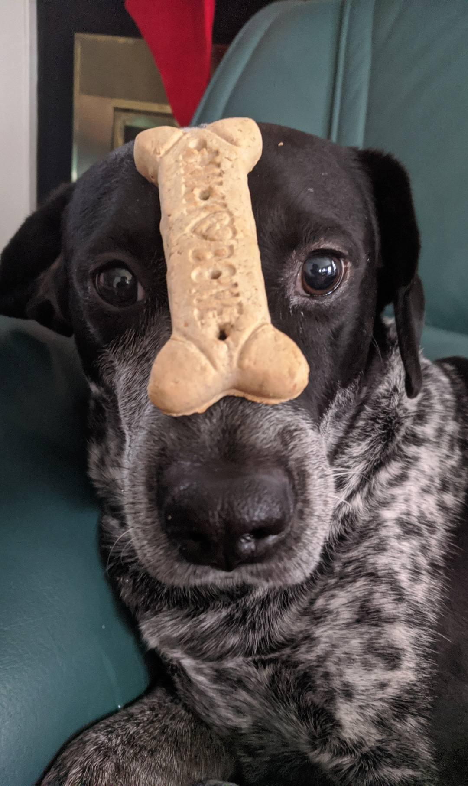</img>
]

---

# RStudio Internship

<div class="my-footer"><span>@chendaniely
&emsp;&emsp;&emsp;&emsp;&emsp;&emsp;NYR Conference 2020
&emsp;&emsp;&emsp;&emsp;&emsp;&emsp;&emsp;&emsp;&emsp;&emsp;&emsp;&emsp;&emsp;
&emsp;&emsp;&emsp;&emsp;&emsp;&emsp;&emsp;&emsp;&emsp;&emsp;&emsp;&emsp;&emsp;
https://github.com/chendaniely/rstatsnyc_2020-learnr_gradethis</span></div>

https://rstudio-education.github.io/gradethis/

- Worked on `gradethis` for my [RStudio 2019 Internship](https://blog.rstudio.com/2019/03/25/summer-interns-2019/)
  - Barret Schloerke, PhD
  - Garrett Grolemund, PhD

- I am a user of R, not a developer.

- Wrote about my experiences:
  - [My time as an intern](https://daniel.rbind.io/2020/01/29/my-time-as-an-rstudio-intern/)
  - [Internship week 1](https://daniel.rbind.io/2019/06/10/and-were-off-rstudio-internship-week-1-complete./)
  - [Internship week 2](https://daniel.rbind.io/2019/06/18/rstudio-internship-week-2/)
  - [Moved to blogdown](https://daniel.rbind.io/2019/07/23/new-website-a-la-blogdown/)
  - [Git workflow](https://daniel.rbind.io/2019/08/27/git-squash-and-merge-workflow/)
  - [Rstudio education blog post](https://education.rstudio.com/blog/2020/02/gestalt-internship/)

---

# Education + Shiny Team

<div class="my-footer"><span>@chendaniely
&emsp;&emsp;&emsp;&emsp;&emsp;&emsp;NYR Conference 2020
&emsp;&emsp;&emsp;&emsp;&emsp;&emsp;&emsp;&emsp;&emsp;&emsp;&emsp;&emsp;&emsp;
&emsp;&emsp;&emsp;&emsp;&emsp;&emsp;&emsp;&emsp;&emsp;&emsp;&emsp;&emsp;&emsp;
https://github.com/chendaniely/rstatsnyc_2020-learnr_gradethis</span></div>

.pull-left[
Education Team

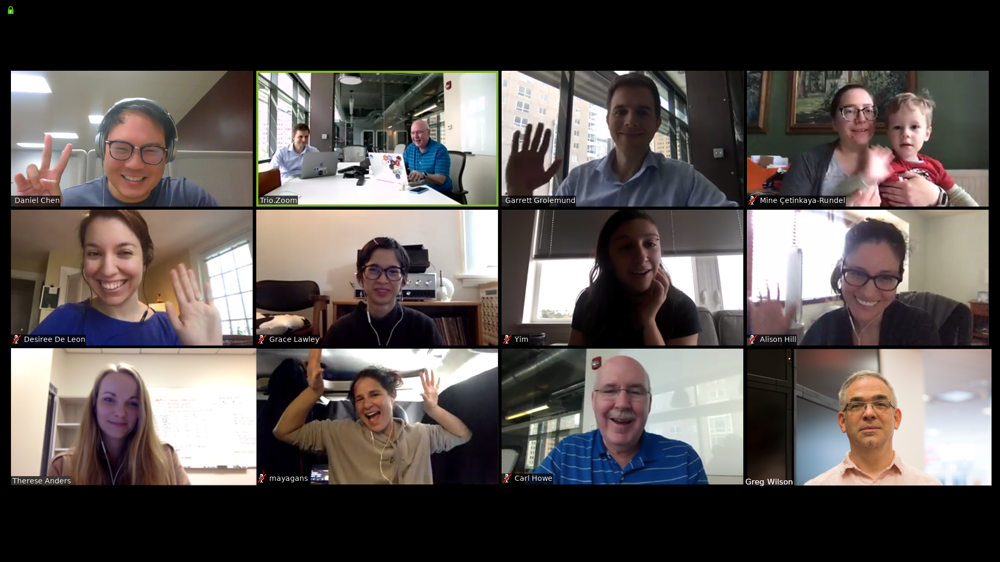
]

.pull-right[
Shiny Team

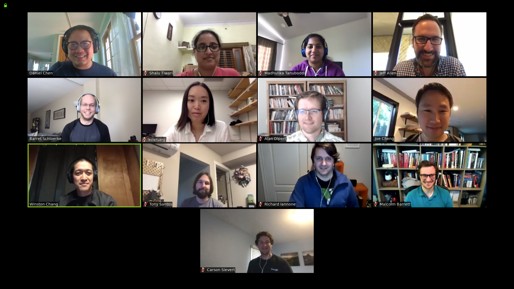
]

---

# Join all the slack channels!

<div class="my-footer"><span>@chendaniely
&emsp;&emsp;&emsp;&emsp;&emsp;&emsp;NYR Conference 2020
&emsp;&emsp;&emsp;&emsp;&emsp;&emsp;&emsp;&emsp;&emsp;&emsp;&emsp;&emsp;&emsp;
&emsp;&emsp;&emsp;&emsp;&emsp;&emsp;&emsp;&emsp;&emsp;&emsp;&emsp;&emsp;&emsp;
https://github.com/chendaniely/rstatsnyc_2020-learnr_gradethis</span></div>

- What? A book about shiny?

- Yes! https://mastering-shiny.org/
- No ):

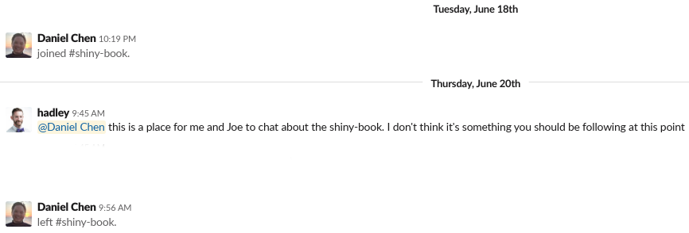

---

# :D

.pull-left[
<center>
</img>
</center>
]
.pull-right[
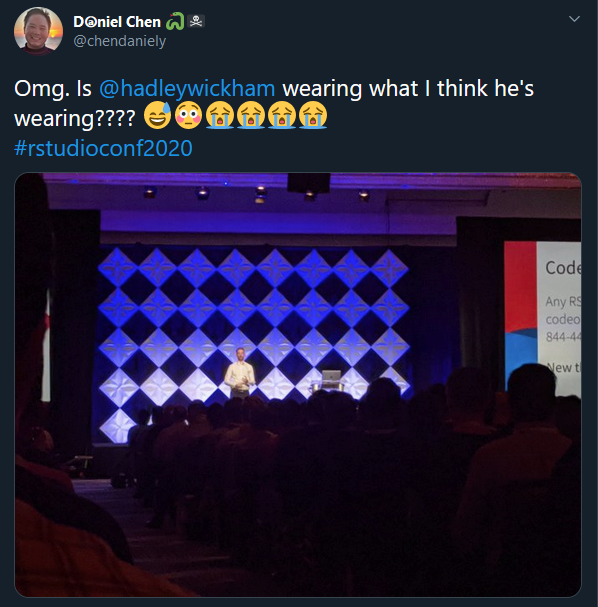</img>
]

---

# Learnr interactive tutorials

<div class="my-footer"><span>@chendaniely
&emsp;&emsp;&emsp;&emsp;&emsp;&emsp;NYR Conference 2020
&emsp;&emsp;&emsp;&emsp;&emsp;&emsp;&emsp;&emsp;&emsp;&emsp;&emsp;&emsp;&emsp;
&emsp;&emsp;&emsp;&emsp;&emsp;&emsp;&emsp;&emsp;&emsp;&emsp;&emsp;&emsp;&emsp;
https://github.com/chendaniely/rstatsnyc_2020-learnr_gradethis</span></div>

https://rstudio.github.io/learnr/


1. Narrative, figures, illustrations, and equations.
2. Code exercises (R code chunks that users can edit and execute directly).
3. Quiz questions.
4. Videos (supported services include YouTube and Vimeo).
5. Interactive Shiny components.


---

# Creating a `learnr` tutorial

<div class="my-footer"><span>@chendaniely
&emsp;&emsp;&emsp;&emsp;&emsp;&emsp;NYR Conference 2020
&emsp;&emsp;&emsp;&emsp;&emsp;&emsp;&emsp;&emsp;&emsp;&emsp;&emsp;&emsp;&emsp;
&emsp;&emsp;&emsp;&emsp;&emsp;&emsp;&emsp;&emsp;&emsp;&emsp;&emsp;&emsp;&emsp;
https://github.com/chendaniely/rstatsnyc_2020-learnr_gradethis</span></div>

```yaml
---
title: "Hello, Tutorial!"
output: learnr::tutorial
runtime: shiny_prerendered
---
```

````markdown
`r ''````{r setup, include=FALSE}
library(learnr)
```

This code computes the answer to one plus one, change it so it computes two plus two:

`r ''````{r addition, exercise=TRUE}
1 + 1
```
````

---

# Learnr output

<div class="my-footer"><span>@chendaniely
&emsp;&emsp;&emsp;&emsp;&emsp;&emsp;NYR Conference 2020
&emsp;&emsp;&emsp;&emsp;&emsp;&emsp;&emsp;&emsp;&emsp;&emsp;&emsp;&emsp;&emsp;
&emsp;&emsp;&emsp;&emsp;&emsp;&emsp;&emsp;&emsp;&emsp;&emsp;&emsp;&emsp;&emsp;
https://github.com/chendaniely/rstatsnyc_2020-learnr_gradethis</span></div>

<center>
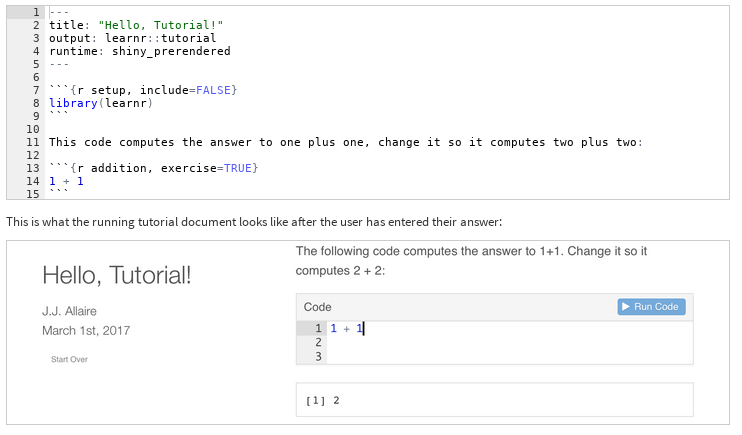
</center>

---

# Sortable

<div class="my-footer"><span>@chendaniely
&emsp;&emsp;&emsp;&emsp;&emsp;&emsp;NYR Conference 2020
&emsp;&emsp;&emsp;&emsp;&emsp;&emsp;&emsp;&emsp;&emsp;&emsp;&emsp;&emsp;&emsp;
&emsp;&emsp;&emsp;&emsp;&emsp;&emsp;&emsp;&emsp;&emsp;&emsp;&emsp;&emsp;&emsp;
https://github.com/chendaniely/rstatsnyc_2020-learnr_gradethis</span></div>

- More `learnr` examples: https://rstudio.github.io/learnr/examples.html
  - `sortable`: https://andrie-de-vries.shinyapps.io/sortable_tutorial_question_rank/

<center>
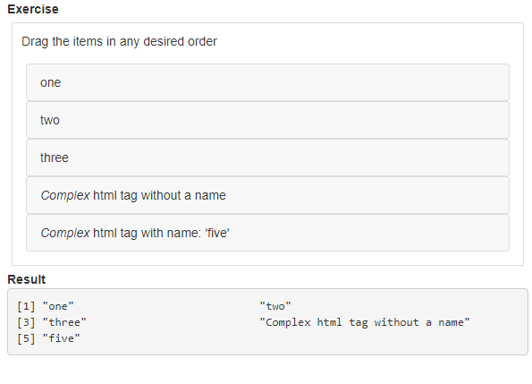
</center>

---

# Sortable -> Parsons

<div class="my-footer"><span>@chendaniely
&emsp;&emsp;&emsp;&emsp;&emsp;&emsp;NYR Conference 2020
&emsp;&emsp;&emsp;&emsp;&emsp;&emsp;&emsp;&emsp;&emsp;&emsp;&emsp;&emsp;&emsp;
&emsp;&emsp;&emsp;&emsp;&emsp;&emsp;&emsp;&emsp;&emsp;&emsp;&emsp;&emsp;&emsp;
https://github.com/chendaniely/rstatsnyc_2020-learnr_gradethis</span></div>

- Parson problems are coding exercises designed to **reduce cognitive load** on the learner.
  - Instead of writing the code, they order code blocks in the correct order
  - Reduces syntax errors
    - Learn the "what" concepts instead of the "how" syntax

https://github.com/rstudio/parsons

---

# Parsons

<div class="my-footer"><span>@chendaniely
&emsp;&emsp;&emsp;&emsp;&emsp;&emsp;NYR Conference 2020
&emsp;&emsp;&emsp;&emsp;&emsp;&emsp;&emsp;&emsp;&emsp;&emsp;&emsp;&emsp;&emsp;
&emsp;&emsp;&emsp;&emsp;&emsp;&emsp;&emsp;&emsp;&emsp;&emsp;&emsp;&emsp;&emsp;
https://github.com/chendaniely/rstatsnyc_2020-learnr_gradethis</span></div>

<center>
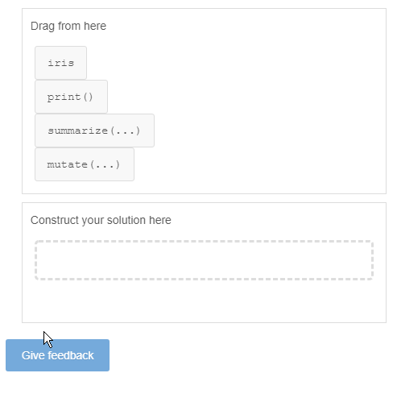
</center>

---

# Grading the questions

<div class="my-footer"><span>@chendaniely
&emsp;&emsp;&emsp;&emsp;&emsp;&emsp;NYR Conference 2020
&emsp;&emsp;&emsp;&emsp;&emsp;&emsp;&emsp;&emsp;&emsp;&emsp;&emsp;&emsp;&emsp;
&emsp;&emsp;&emsp;&emsp;&emsp;&emsp;&emsp;&emsp;&emsp;&emsp;&emsp;&emsp;&emsp;
https://github.com/chendaniely/rstatsnyc_2020-learnr_gradethis</span></div>

We can create questions, but how do we give feedback?

At the very least how to we tell the student the solution they provided was "wrong"?

---

# Look at the result

<div class="my-footer"><span>@chendaniely
&emsp;&emsp;&emsp;&emsp;&emsp;&emsp;NYR Conference 2020
&emsp;&emsp;&emsp;&emsp;&emsp;&emsp;&emsp;&emsp;&emsp;&emsp;&emsp;&emsp;&emsp;
&emsp;&emsp;&emsp;&emsp;&emsp;&emsp;&emsp;&emsp;&emsp;&emsp;&emsp;&emsp;&emsp;
https://github.com/chendaniely/rstatsnyc_2020-learnr_gradethis</span></div>

- Only check if the solutions match
- As long as the correct answer is returned, it doesn't matter how the student got the answer
  - Can't check if you are trying to teach a specific function

E.g., `3 + 3 = 6 = 2 * 3`

---

# Look at the code

<div class="my-footer"><span>@chendaniely
&emsp;&emsp;&emsp;&emsp;&emsp;&emsp;NYR Conference 2020
&emsp;&emsp;&emsp;&emsp;&emsp;&emsp;&emsp;&emsp;&emsp;&emsp;&emsp;&emsp;&emsp;
&emsp;&emsp;&emsp;&emsp;&emsp;&emsp;&emsp;&emsp;&emsp;&emsp;&emsp;&emsp;&emsp;
https://github.com/chendaniely/rstatsnyc_2020-learnr_gradethis</span></div>

- Essentially compares the actual code (e.g., the text)
- It's very strict
  - `3 + 3` != `2 * 3`
  - `apply(df, 2, class)` != `apply(df, MARGIN = 2, FUN = class)`
  - `mean(1:5)` != `mean(1:5, na.rm=FALSE)`

---

# Look at the code's AST

<div class="my-footer"><span>@chendaniely
&emsp;&emsp;&emsp;&emsp;&emsp;&emsp;NYR Conference 2020
&emsp;&emsp;&emsp;&emsp;&emsp;&emsp;&emsp;&emsp;&emsp;&emsp;&emsp;&emsp;&emsp;
&emsp;&emsp;&emsp;&emsp;&emsp;&emsp;&emsp;&emsp;&emsp;&emsp;&emsp;&emsp;&emsp;
https://github.com/chendaniely/rstatsnyc_2020-learnr_gradethis</span></div>

- The Abstract Syntax Tree (AST) is a graphical (i.e., tree) representation of
your code.
- It shows the order of function calls and their arguments to be executed.

.pull-left[
```{r}
lobstr::ast(
  log(exp(3))
)
```

```{r}
lobstr::ast(
  log(exp(2))
)
```
]

.pull-right[
```{r}
lobstr::ast(
  log(log(2, base = 10))
)
```
]

---

# Gradethis

<div class="my-footer"><span>@chendaniely
&emsp;&emsp;&emsp;&emsp;&emsp;&emsp;NYR Conference 2020
&emsp;&emsp;&emsp;&emsp;&emsp;&emsp;&emsp;&emsp;&emsp;&emsp;&emsp;&emsp;&emsp;
&emsp;&emsp;&emsp;&emsp;&emsp;&emsp;&emsp;&emsp;&emsp;&emsp;&emsp;&emsp;&emsp;
https://github.com/chendaniely/rstatsnyc_2020-learnr_gradethis</span></div>

https://rstudio-education.github.io/gradethis/

- Auto grading system that can be used to grade `learnr` exercises.
  - Check the answer
  - Check the code (using the AST)

- In `learnr`, each exercise is completely independent from the others

- What makes it unique is its ability to give formative feedback to the student.

- `leanr` but why not `grader`?
  - The package was originally named `grader`
  - Someone from UVA took the name on CRAN during the first few weeks of the internship.
  - https://github.com/rstudio-education/gradethis/issues/18

---

# Formative feedback

<div class="my-footer"><span>@chendaniely
&emsp;&emsp;&emsp;&emsp;&emsp;&emsp;NYR Conference 2020
&emsp;&emsp;&emsp;&emsp;&emsp;&emsp;&emsp;&emsp;&emsp;&emsp;&emsp;&emsp;&emsp;
&emsp;&emsp;&emsp;&emsp;&emsp;&emsp;&emsp;&emsp;&emsp;&emsp;&emsp;&emsp;&emsp;
https://github.com/chendaniely/rstatsnyc_2020-learnr_gradethis</span></div>

<center>
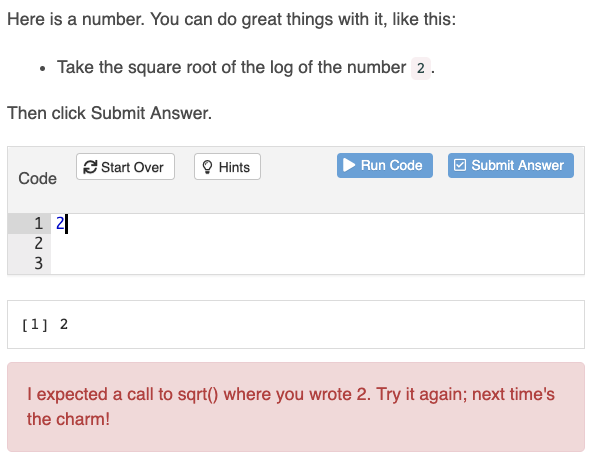
</center>

---

# `learnr` + `gradethis`

<div class="my-footer"><span>@chendaniely
&emsp;&emsp;&emsp;&emsp;&emsp;&emsp;NYR Conference 2020
&emsp;&emsp;&emsp;&emsp;&emsp;&emsp;&emsp;&emsp;&emsp;&emsp;&emsp;&emsp;&emsp;
&emsp;&emsp;&emsp;&emsp;&emsp;&emsp;&emsp;&emsp;&emsp;&emsp;&emsp;&emsp;&emsp;
https://github.com/chendaniely/rstatsnyc_2020-learnr_gradethis</span></div>

1. base chunk: what the student sees in the exercise
2. `-check` chunk: how should the student's code be graded
    1. solution: are you just checking the final result?
        - `gradethis::grade_result()`
        - Provide a set of conditions to check, returns result on *first match* (i.e., order of conditions matter)
    2. code: are you checking to see the code itself is correct (AST)
        - `gradethis::grade_code()`
        - `-solution` chunk: The instructor's solution code that will be used to compare to the student's code
    3. unittests: are you testing a function that needs to pass a bunch of checks?
        - `gradethis::grade_conditions()`
3. `-hint` chunks (optional)

---

# `learnr`

<div class="my-footer"><span>@chendaniely
&emsp;&emsp;&emsp;&emsp;&emsp;&emsp;NYR Conference 2020
&emsp;&emsp;&emsp;&emsp;&emsp;&emsp;&emsp;&emsp;&emsp;&emsp;&emsp;&emsp;&emsp;
&emsp;&emsp;&emsp;&emsp;&emsp;&emsp;&emsp;&emsp;&emsp;&emsp;&emsp;&emsp;&emsp;
https://github.com/chendaniely/rstatsnyc_2020-learnr_gradethis</span></div>

Set the checking function for `learnr`

````markdown
`r ''````{r setup}
library(gradethis)
tutorial_options(exercise.checker = gradethis::grade_learnr)
```
````

We can scaffold the exercise to reduce cognitive load.

````markdown
`r ''````{r chunkLabel, exercise=TRUE}
log(_____(_____))
```
````

And want the student to enter

````markdown
`r ''````{r chunkLabel, exercise=TRUE}
log(exp(3))
```
````

---

# `learnr` + `gradethis::grade_result()`

<div class="my-footer"><span>@chendaniely
&emsp;&emsp;&emsp;&emsp;&emsp;&emsp;NYR Conference 2020
&emsp;&emsp;&emsp;&emsp;&emsp;&emsp;&emsp;&emsp;&emsp;&emsp;&emsp;&emsp;&emsp;
&emsp;&emsp;&emsp;&emsp;&emsp;&emsp;&emsp;&emsp;&emsp;&emsp;&emsp;&emsp;&emsp;
https://github.com/chendaniely/rstatsnyc_2020-learnr_gradethis</span></div>

````markdown
`r ''````{r chunkLabel, exercise=TRUE}
log(_____(_____))
```

`r ''````{r chunkLabel-hint-1}
# hint text
"Exponentiate with the `exp` function."
```

`r ''````{r chunkLabel-check}
# check result
gradethis::grade_result(
  # pass_if fail_if order does matter. Maybe put pass_if conditions last?

  #.result is the last value returned by the student
  gradethis::pass_if(~ identical(.result, 3), "YAY!"),
  gradethis::fail_if(function(x){identical(x, 4)}, "4 is an incorrect input.")
  gradethis::fail_if(2, "2 was the wrong number to use here.")
)
```
````

---

# `learnr` + `gradethis::grade_code()`

<div class="my-footer"><span>@chendaniely
&emsp;&emsp;&emsp;&emsp;&emsp;&emsp;NYR Conference 2020
&emsp;&emsp;&emsp;&emsp;&emsp;&emsp;&emsp;&emsp;&emsp;&emsp;&emsp;&emsp;&emsp;
&emsp;&emsp;&emsp;&emsp;&emsp;&emsp;&emsp;&emsp;&emsp;&emsp;&emsp;&emsp;&emsp;
https://github.com/chendaniely/rstatsnyc_2020-learnr_gradethis</span></div>

````markdown
`r ''````{r chunkLabel, exercise=TRUE}
log(_____(_____))
```

`r ''````{r chunkLabel-hint-1}
# hint text
"Exponentiate with the `exp` function."
```

`r ''````{r chunkLabel-solution}
# solution code
log(exp(3))
```

`r ''````{r chunkLabel-check}
# check code
gradethis::grade_code()
```
````

---

# `learnr` + `gradethis::grade_conditions()`

<div class="my-footer"><span>@chendaniely
&emsp;&emsp;&emsp;&emsp;&emsp;&emsp;NYR Conference 2020
&emsp;&emsp;&emsp;&emsp;&emsp;&emsp;&emsp;&emsp;&emsp;&emsp;&emsp;&emsp;&emsp;
&emsp;&emsp;&emsp;&emsp;&emsp;&emsp;&emsp;&emsp;&emsp;&emsp;&emsp;&emsp;&emsp;
https://github.com/chendaniely/rstatsnyc_2020-learnr_gradethis</span></div>

````markdown
`r ''````{r grade_conditions, exercise = TRUE}
# student code
add_1 <- function(x) {x + 1}
```

`r ''````{r grade_conditions-hint-1}
# hint text
"Function should take a parameter and add 1 to it"
```

`r ''````{r grade_conditions-check}
gradethis::grade_conditions(
  gradethis::pass_if(~ .result(3) == 4),
  gradethis::pass_if(~ .result(-1) == 0),
  gradethis::fail_if(~ .result(10) == 11)
)
```
````

---

# Chunk names matter

<div class="my-footer"><span>@chendaniely
&emsp;&emsp;&emsp;&emsp;&emsp;&emsp;NYR Conference 2020
&emsp;&emsp;&emsp;&emsp;&emsp;&emsp;&emsp;&emsp;&emsp;&emsp;&emsp;&emsp;&emsp;
&emsp;&emsp;&emsp;&emsp;&emsp;&emsp;&emsp;&emsp;&emsp;&emsp;&emsp;&emsp;&emsp;
https://github.com/chendaniely/rstatsnyc_2020-learnr_gradethis</span></div>

.pull-left[
````markdown
`r ''````{r chunkLabel, exercise=TRUE}
log(_____(_____))
```

`r ''````{r chunkLabel-hint-1}
# hint text
"Exponentiate with the `exp` function."
```

`r ''````{r chunkLabel-solution}
# solution code
log(exp(3))
```

`r ''````{r chunkLabel-check}
# check code
gradethis::grade_code()
```
````
]

.pull-right[
- The hints/soluction/check blocks use the same base name for association
- `knitr` chunks need to be unique
]

---

# `gradethis` chunk addins

<div class="my-footer"><span>@chendaniely
&emsp;&emsp;&emsp;&emsp;&emsp;&emsp;NYR Conference 2020
&emsp;&emsp;&emsp;&emsp;&emsp;&emsp;&emsp;&emsp;&emsp;&emsp;&emsp;&emsp;&emsp;
&emsp;&emsp;&emsp;&emsp;&emsp;&emsp;&emsp;&emsp;&emsp;&emsp;&emsp;&emsp;&emsp;
https://github.com/chendaniely/rstatsnyc_2020-learnr_gradethis</span></div>

.pull-left[
- Creates random chunk names

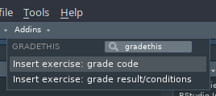
]

.pull-right[
````markdown
`r ''````{r qhdcovmzxfhuycxw, exercise = TRUE}
# student code
____
```

`r ''````{r qhdcovmzxfhuycxw-hint-1}
# hint text
""
```

`r ''````{r qhdcovmzxfhuycxw-solution}
# solution code

```

`r ''````{r qhdcovmzxfhuycxw-check}
# check code
gradethis::grade_code()
```
````
]
---

# Be careful with `==`

<div class="my-footer"><span>@chendaniely
&emsp;&emsp;&emsp;&emsp;&emsp;&emsp;NYR Conference 2020
&emsp;&emsp;&emsp;&emsp;&emsp;&emsp;&emsp;&emsp;&emsp;&emsp;&emsp;&emsp;&emsp;
&emsp;&emsp;&emsp;&emsp;&emsp;&emsp;&emsp;&emsp;&emsp;&emsp;&emsp;&emsp;&emsp;
https://github.com/chendaniely/rstatsnyc_2020-learnr_gradethis</span></div>

- https://daniel.rbind.io/2019/08/06/inconsistencies-with-in-r/
  - "inconsistency", "improper documentation", "bug"

```{r}
# only difference is the last parameter
u <- quote(f(x123456789012345678901234567890123456789012345678901234567890, 1))

s <- quote(f(x123456789012345678901234567890123456789012345678901234567890, 2))
```

```{r}
u == s
```

```{r}
identical(u, s)
```

- Take away: use `idential` or `all.equal` instead of `==` when doing (non-vectorized) comparisons.
  - Vignette in PR: https://github.com/rstudio-education/gradethis/pull/102

---

# Dev guide: `learnr` vs `gradethis`

<div class="my-footer"><span>@chendaniely
&emsp;&emsp;&emsp;&emsp;&emsp;&emsp;NYR Conference 2020
&emsp;&emsp;&emsp;&emsp;&emsp;&emsp;&emsp;&emsp;&emsp;&emsp;&emsp;&emsp;&emsp;
&emsp;&emsp;&emsp;&emsp;&emsp;&emsp;&emsp;&emsp;&emsp;&emsp;&emsp;&emsp;&emsp;
https://github.com/chendaniely/rstatsnyc_2020-learnr_gradethis</span></div>

- `learnr` is responsible for
  - Expression capturing
  - Data reporting
    - How many questions did my student get "correct"?
    - How much time did my students take for each question or for the entire document?

- `gradethis` is responsible for:
  - Checking the student solution
  - Correct/Incorrect message + praise/encouragement

---

# Dev guide: `learnr` checker

<div class="my-footer"><span>@chendaniely
&emsp;&emsp;&emsp;&emsp;&emsp;&emsp;NYR Conference 2020
&emsp;&emsp;&emsp;&emsp;&emsp;&emsp;&emsp;&emsp;&emsp;&emsp;&emsp;&emsp;&emsp;
&emsp;&emsp;&emsp;&emsp;&emsp;&emsp;&emsp;&emsp;&emsp;&emsp;&emsp;&emsp;&emsp;
https://github.com/chendaniely/rstatsnyc_2020-learnr_gradethis</span></div>

- `learnr` is a complex piece of software that needs a deep understanding of `knitr`, `rmarkdown`, and `shiny`.
  - Nischal Shrestha (2020 Intern): https://education.rstudio.com/blog/2020/07/learning-learnr/

- All of the exercise components in the `learnr` document are passed into the `exercise.checker`.
  - This is an entry point if you want to write your own `learnr` checker

- To enable exercise checking in your learnr tutorial:

````markdown
`r ''````{r setup}
library(gradethis)
tutorial_options(exercise.checker = gradethis::grade_learnr)
```
````

- The `grade_learnr` function:
  - The function `learnr` passes all the chunk code into
  - Passes into the corresponding `gradethis::grade_` function

---

# Dev guide: Pipes

<div class="my-footer"><span>@chendaniely
&emsp;&emsp;&emsp;&emsp;&emsp;&emsp;NYR Conference 2020
&emsp;&emsp;&emsp;&emsp;&emsp;&emsp;&emsp;&emsp;&emsp;&emsp;&emsp;&emsp;&emsp;
&emsp;&emsp;&emsp;&emsp;&emsp;&emsp;&emsp;&emsp;&emsp;&emsp;&emsp;&emsp;&emsp;
https://github.com/chendaniely/rstatsnyc_2020-learnr_gradethis</span></div>

```r
df %>% dplyr::select(col1)
```

unpipes into

```r
dplyr::select(df, col1)
```

---

# Standalone code grader: result

<div class="my-footer"><span>@chendaniely
&emsp;&emsp;&emsp;&emsp;&emsp;&emsp;NYR Conference 2020
&emsp;&emsp;&emsp;&emsp;&emsp;&emsp;&emsp;&emsp;&emsp;&emsp;&emsp;&emsp;&emsp;
&emsp;&emsp;&emsp;&emsp;&emsp;&emsp;&emsp;&emsp;&emsp;&emsp;&emsp;&emsp;&emsp;
https://github.com/chendaniely/rstatsnyc_2020-learnr_gradethis</span></div>

```{r}
library(gradethis)

student_solution <- 5
```

```{r}
graded_result <- gradethis::grade_result(
  pass_if(5, "You also got a value of 5!"),
  learnr_args = list(last_value = student_solution)
)

graded_result
```

---

# Standalone code grader: code

<div class="my-footer"><span>@chendaniely
&emsp;&emsp;&emsp;&emsp;&emsp;&emsp;NYR Conference 2020
&emsp;&emsp;&emsp;&emsp;&emsp;&emsp;&emsp;&emsp;&emsp;&emsp;&emsp;&emsp;&emsp;
&emsp;&emsp;&emsp;&emsp;&emsp;&emsp;&emsp;&emsp;&emsp;&emsp;&emsp;&emsp;&emsp;
https://github.com/chendaniely/rstatsnyc_2020-learnr_gradethis</span></div>

```{r}
student_code  <- quote(sqrt(exp(3)))
solution_code <- quote(sqrt(log(2)))
```

```{r}
graded_code <- gradethis::grade_code(grader_args = list(
  user_quo = student_code,
  solution_quo = solution_code
  )
)

graded_code
```
---

# Internship: `eval_tidy` example

<div class="my-footer"><span>@chendaniely
&emsp;&emsp;&emsp;&emsp;&emsp;&emsp;NYR Conference 2020
&emsp;&emsp;&emsp;&emsp;&emsp;&emsp;&emsp;&emsp;&emsp;&emsp;&emsp;&emsp;&emsp;
&emsp;&emsp;&emsp;&emsp;&emsp;&emsp;&emsp;&emsp;&emsp;&emsp;&emsp;&emsp;&emsp;
https://github.com/chendaniely/rstatsnyc_2020-learnr_gradethis</span></div>

```{r}
form <- ~ x ^ 2 # capture an expression + environment
str(form)
```

```{r}
form[[2]] # just get the expression
```

```{r}
rlang::eval_tidy(
  expr = form[[2]], # evaluate the expression with data + environment
  data = list(x = 15),
  env = .GlobalEnv
)
```

---

# Internship: `eval_tidy` in practice

<div class="my-footer"><span>@chendaniely
&emsp;&emsp;&emsp;&emsp;&emsp;&emsp;NYR Conference 2020
&emsp;&emsp;&emsp;&emsp;&emsp;&emsp;&emsp;&emsp;&emsp;&emsp;&emsp;&emsp;&emsp;
&emsp;&emsp;&emsp;&emsp;&emsp;&emsp;&emsp;&emsp;&emsp;&emsp;&emsp;&emsp;&emsp;
https://github.com/chendaniely/rstatsnyc_2020-learnr_gradethis</span></div>

https://github.com/rstudio-education/gradethis/blob/master/R/evaluate_condition.R

During `gradethis::grade_result`:

```r
switch(condition$type,
           "formula" = evaluate_condi_formula(condition$x, learnr_args$last_value, learnr_args$envir_prep), # nolint
           "function" = evaluate_condi_function(condition$x, learnr_args$last_value),
           "value" = evaluate_condi_value(condition$x, learnr_args$last_value)
         )
```

```r
evaluate_condi_formula <- function(formula, user_answer, env) {
  form_result <- rlang::eval_tidy(
    formula[[2]],
    data = list(.result = user_answer, . = user_answer),
    env = env
  )
  return(form_result)
}
```
---

# Python!

<div class="my-footer"><span>@chendaniely
&emsp;&emsp;&emsp;&emsp;&emsp;&emsp;NYR Conference 2020
&emsp;&emsp;&emsp;&emsp;&emsp;&emsp;&emsp;&emsp;&emsp;&emsp;&emsp;&emsp;&emsp;
&emsp;&emsp;&emsp;&emsp;&emsp;&emsp;&emsp;&emsp;&emsp;&emsp;&emsp;&emsp;&emsp;
https://github.com/chendaniely/rstatsnyc_2020-learnr_gradethis</span></div>

- pygradethis by Nischal Shrestha (Current RStudio intern)
    - https://github.com/nischalshrestha/pygradethis

- Can use Python + `learnr` to check results, but checking the result is more involved.
    - Python does not have a `quote` function
    - Working with code expressions involve quoting things as strings and using `ast.parse()`
    
#### Still in (very active) development

```python
grade_code("2 + sqrt(log(2))", "2 + sqrt(log(1))")
```

> I expected 1, but you wrote 2 in log(2) at line 1.

---

class: center, middle, inverse


# Thanks!

<div class="my-footer"><span>@chendaniely
&emsp;&emsp;&emsp;&emsp;&emsp;&emsp;NYR Conference 2020
&emsp;&emsp;&emsp;&emsp;&emsp;&emsp;&emsp;&emsp;&emsp;&emsp;&emsp;&emsp;&emsp;
&emsp;&emsp;&emsp;&emsp;&emsp;&emsp;&emsp;&emsp;&emsp;&emsp;&emsp;&emsp;&emsp;
https://github.com/chendaniely/rstatsnyc_2020-learnr_gradethis</span></div>

.pull-left[
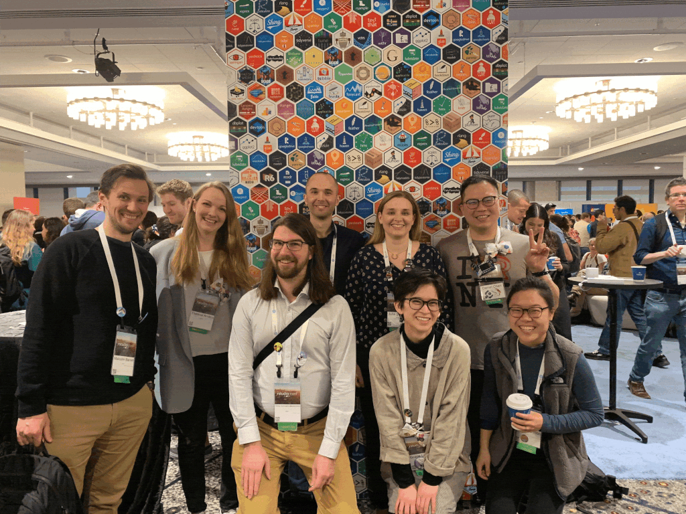
]

.pull-right[
[@chendaniely](https://twitter.com/chendaniely)

slides: https://github.com/chendaniely/rstatsnyc_2020-learnr_gradethis

pdf: https://speakerdeck.com/chendaniely/rstatsnyc_2020-learnr_gradethis
]
